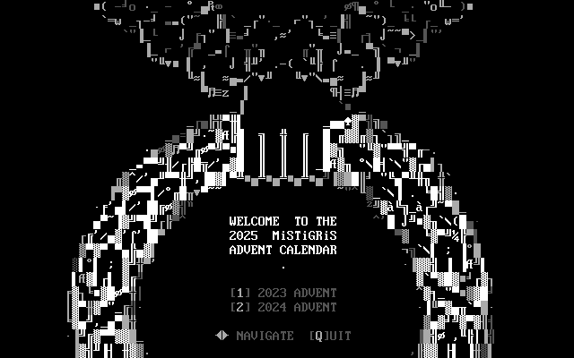

# MiSTiGRiS Advent Calendar



An interactive BBS door program that displays ANSI Christmas art, a new one each day in December. Browse past collections as well. Compatible with all modern BBS systems that support Door32 dropfiles -- Windows and Linux.

## Quick Setup

### Windows

```batch
@echo off
set NODE=%1
if "%NODE%"=="" set NODE=1

cd /d "C:\bbs\doors\advent"
set DROPFILE_PATH=C:\bbs\temp\%NODE%\door32.sys

advent.exe -path "%DROPFILE_PATH%"
```

### Linux

```bash
#!/bin/bash
NODE=${1:-1}
cd /opt/bbs/doors/advent
DROPFILE_PATH="/opt/bbs/temp/${NODE}/door32.sys"

./advent -path "$DROPFILE_PATH"
```

Make executable: `chmod +x advent.sh advent-linux-amd64`

## Command Line Options

```
-path string           Path to door32.sys file
-local                 Run in local UTF-8 mode (not BBS mode)
-socket-host string    BBS server IP address (default "127.0.0.1")
-debug                 Enable debug logging
-debug-date string     Override date (YYYY-MM-DD)
-debug-disable-date    Disable date validation
-debug-disable-art     Disable art validation
```

## Building from Source

### For Modern Systems (Windows 10+, Linux, Mac)

Prerequisites: Go 1.24 or later, Git

```bash
# Clone repository
git clone https://github.com/robbiew/mg_advent.git
cd mg_advent

# Linux/Mac build (builds Linux amd64, arm64, and Windows 386)
./build.sh

# Windows build
build.bat
```

### For Windows 7 32-bit Compatibility

Windows 7 requires Go 1.20 (last version with Windows 7 support).

**One-time setup:**
```bash
# Install Go 1.20.14 toolchain
go install golang.org/dl/go1.20.14@latest
go1.20.14 download
```

**Building:**
```bash
# Linux/Mac (cross-compile)
./build.sh  # Automatically uses go1.20.14 for Windows builds

# Windows
build.bat   # Checks for go1.20.14, shows install instructions if needed

# Manual build
GOOS=windows GOARCH=386 CGO_ENABLED=0 ~/go/bin/go1.20.14 build -ldflags="-s -w" -o dist/advent-windows-386.exe ./cmd/advent
```

**Note:** The `build.sh` and `build.bat` scripts automatically detect and use Go 1.20.14 for Windows builds to ensure Windows 7 compatibility.

## Testing

```bash
# Local testing (no BBS required)
# Skip date restrictions to view any day's art
./advent -local -debug-disable-date -debug-date=2024-12-15
```

## Usage

- **Arrow Keys**: Navigate between days
- **1, 2, 3**: Jump to different years (2023, 2024, 2025)
- **Q or ESC**: Return to welcome screen / exit
- **I**: View info file
- **M**: View members list

## License

This project is released under the terms specified in the LICENSE file.
